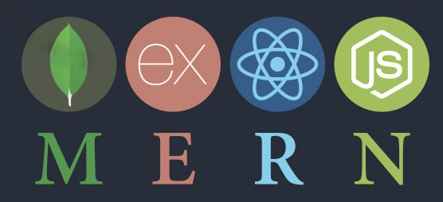

  
  <h1 text-align="center">Hi! 🙋‍♂️ My name is Ritchie</h1>

## I have a bachelor of Science Degree in Digital Systems and Robotics from Tecnológico de Monterrey Campus Puebla 🤖. I am a Full Stack Web Developer MERN with over 2 years of experience 👨🏻‍💻

  

### I have experience working with the following programming languages: ✍️

  
  
  
  

### Strong Knowledge in: 📖
- Git 
- Circle CI (CI/CD)
- Redux.js
- Express.js and mongoose
- API REST
- Unit Test

### My projects...
- [Agronomist Robot](https://github.com/RickardGS4991/GA-ULV)
- [Star Wars Game for iPhone](https://github.com/RickardGS4991/starwarsiOsGame)
- [Recognizer built with Flex and Bison](https://github.com/RickardGS4991/finalRecognizer/tree/main)
- [Tlapacoyan Principal Page](https://github.com/RickardGS4991/tlapa-web-page)

<!--
**RickardGS4991/RickardGS4991** is a ✨ _special_ ✨ repository because its `README.md` (this file) appears on your GitHub profile.

Here are some ideas to get you started:

- 🔭 I’m currently working on ...
- 🌱 I’m currently learning ...
- 👯 I’m looking to collaborate on ...
- 🤔 I’m looking for help with ...
- 💬 Ask me about ...
- 📫 How to reach me: ...
- 😄 Pronouns: ...
- ⚡ Fun fact: ...
-->
